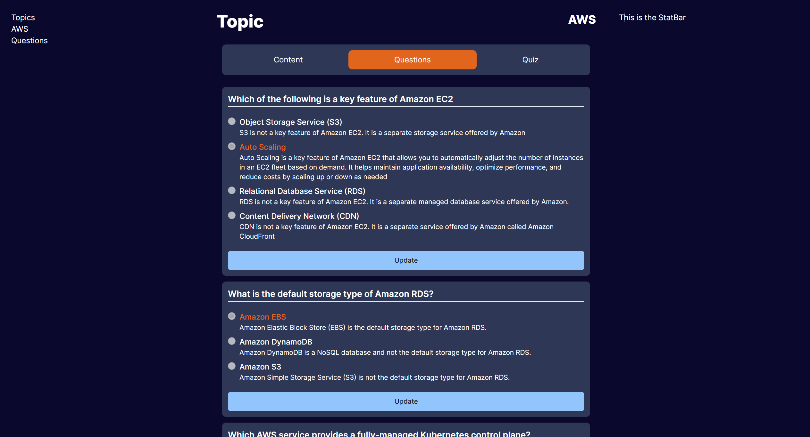

### Current Progress


### Custom Hook
Practice: useFetch
```tsx
const useFetch = (url) => {
  const [data, setData] = useState(null);
  const [loading, setLoading] = useState(null);
  const [error, setError] = useState(null);

  useDidUpdateEffect(() => {
    setLoading(true);
    axios
      .get(url)
      .then(res => {
        setData(res);
      })
      .catch(err => {
        setError(err);
      })
      .finally(() => {
        setLoading(false);
      });
  })

  return { data, loading, error }
}
```

```bash
npm install -D @hookform/devtools
```


```tsx
function demo () {
  const { register, handleSubmit, control } = useForm();

  onSubmit

  return (
    <form onSubmit={}>
      <label htmlFor="username" />
      <input type="text" id="username" {...register("username")} />


      <Devtools control={control}/>
    </form>

  )
}

```

QuestionCard:
  - isUpdating
  - 